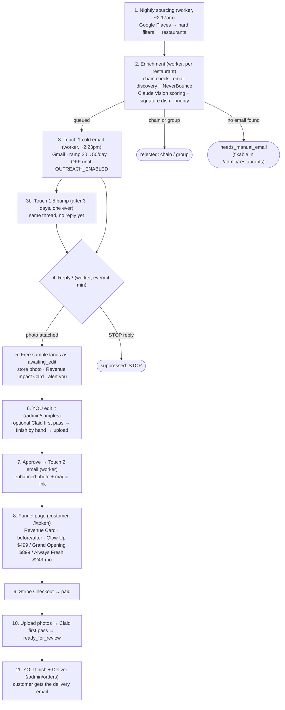
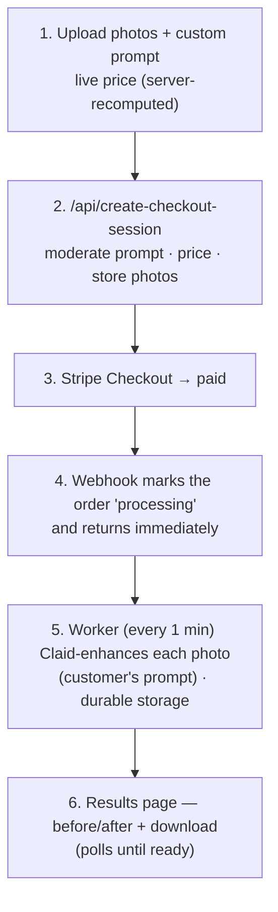

# Clickworthy — Pipeline & Workflow

How the system works end to end. Two pipelines run on **two Railway services**
(the `web` Next.js app and the `worker`), sharing one Postgres database.

- **web** — the Next.js app: landing page, `/enhance`, `/l/[token]` funnel, `/admin`, all API routes, Stripe webhook.
- **worker** — the background service (`worker/`): pg-boss queues + crons for sourcing, enrichment, outreach, reply handling, and enhancement.

Two core principles:

1. **No photo is enhanced before a restaurant asks for it.** The cold email
   *offers* enhancement; the restaurant replies with a photo; only then does any
   enhancement run. Cost scales with *replies*, not with restaurants contacted.
2. **A human finishes every photo a customer sees.** Claid is a first pass, never
   the final product, and never auto-sends. Enrique and Jose edit and approve.

---

## Pipeline A — Outreach funnel (high-ticket packages)

### Step detail

1. **Nightly sourcing** — `worker/jobs/sourceLeads.ts`. Google Places Text Search for restaurants in Miami / New York / Chicago / Los Angeles → hard filters (rating ≤ 4.0, 30–500 reviews, `$`/`$$`, operational) → upsert to `restaurants` (`sourced`) → queue an enrichment job each. Google photos are **never stored** (ToS).
2. **Enrichment** — `worker/jobs/enrichRestaurant.ts`. Hospitality-group check (Claude + web search, also grabs the owner's first name when findable) → email discovery (scrape the site — Places has no emails) → **NeverBounce** verify → Claude Vision photo scoring, which also names the **signature dish** → priority score. Ends `queued`, `needs_manual_email`, or `rejected`. A restaurant with no signature dish is held back — a generic Touch 1 is a deleted Touch 1.
3. **Touch 1** — `worker/jobs/sendOutreach.ts`. Deliverability guard → daily ramp cap → highest-priority `queued` restaurants → **approved static template** (EN/ES, merges signature dish + first name, subject rotates across 3 approved lines) → Gmail send from `mail@clickworthytool.com` → record thread, mark `contacted`. **Gated by `OUTREACH_ENABLED` (off by default).**
   - **3b. Touch 1.5 bump** — `worker/jobs/sendBumps.ts`. 3 days, no reply → one same-thread bump, ever. The approved copy promises we won't follow up again, and the one-bump guard enforces that.
4. **Reply loop** — `worker/jobs/pollReplies.ts`. Match inbound replies to their thread. `STOP` → suppress. Photo attached → store it, generate the Revenue Impact Card, create the magic link as **`awaiting_edit`**, and alert you so the same-day turnaround actually happens.
5. **Free sample = manual production.** Nothing is auto-enhanced. The reply sits in `/admin/samples` waiting for a human.
6. **You edit it** — `/admin/samples`. Optionally run a one-click **Claid first pass** to start from, finish the photo by hand, upload the finished version.
7. **Approve → Touch 2** — approving sets the finished photo and flips the link to `approved`; `worker/jobs/sendTouch2.ts` then emails it with a link to `/l/[token]`.
8. **Funnel** — `app/l/[token]`. Revenue Impact Card → free before/after → "N more photos" teaser → the three tiers (Menu Glow-Up $499, Grand Opening $899 one-time; Always Fresh $249/mo sold on a call). Bilingual EN/ES.
9. **Payment** — `app/api/outreach/checkout` (price resolved server-side; `always_fresh` is rejected there, not just hidden in the UI) → Stripe → the shared webhook marks the link paid.
10. **Upload + first pass** — `app/l/[token]/upload` → customer uploads up to the package limit → `worker/jobs/processPackage.ts` (cron every 1 min) runs a Claid **first pass** on each photo and sets `ready_for_review`. The customer does **not** see these.
11. **You finish + deliver** — `/admin/orders`. Per photo: re-run Claid or upload your edited version. "Deliver order" flips it to `completed`, unlocks the customer's download page, and sends the delivery email.

---

## Pipeline B — Self-serve `/enhance` (what the public landing sells)

This is what the **public landing page sells** — anyone can use it directly, no
outreach needed. Sliding price ($3.00/photo down to a $1.80 floor at 13+),
Claude moderates the free-text prompt, and price is always recalculated
server-side.

The webhook deliberately does **no** enhancement work: Claid takes ~1 min per
photo and Stripe re-delivers a webhook it hasn't heard back from in ~30s, so
enhancing inline would time out and the retry would re-run the whole batch at
double the Claid cost. The webhook only flips `pending → processing` (and only
from `pending`, so duplicate deliveries are harmless);
`worker/jobs/processEnhancementOrders.ts` does the work.

The high-ticket packages are deliberately **not** shown here or on the landing —
they exist only inside the outreach funnel.

---

## Admin — where you actually work

`/admin`, behind Basic Auth (`proxy.ts` covers `/admin/*` and `/api/admin/*`).

| Tab | What it's for |
|---|---|
| Overview | 7-day sends / replies / reply rate, pipeline counts, what needs attention |
| Restaurants | Browse + filter leads; fix a missing email (releases the row back to `queued`); suppress |
| Outreach | Every email sent, with the exact body that went out |
| Samples | The edit queue, plus approved/rejected history |
| Orders | Package production queue, all package orders, self-serve orders |
| Suppressions | Do-not-contact list; STOP replies land here automatically |

---

## Running underneath everything

- **Retries** with backoff on every Claid enhance and Gmail send (`worker/lib/retry.ts`).
- **Operator alerts** via Resend on new replies, orders ready, and failures (`lib/alerts.ts`).
- **Deliverability auto-pause** — cold sending pauses itself if the 7-day opt-out/bounce rate exceeds 8%.
- **Weekly report** — pipeline stats emailed every Monday (`worker/jobs/weeklyStats.ts`).

---

## Where things live

| Concern | Path |
|---|---|
| Sourcing / enrichment / outreach jobs | `worker/jobs/`, `worker/lib/` |
| Queue + cron wiring | `worker/index.ts` |
| Landing page | `app/page.tsx`, `app/components/Header.tsx` |
| `/enhance` self-serve | `app/enhance/`, `app/api/create-checkout-session`, `app/api/webhooks/stripe` |
| Outreach funnel | `app/l/[token]/`, `app/api/outreach/` |
| Admin | `app/admin/`, `app/api/admin/`, `proxy.ts` (Basic Auth) |
| Shared libs | `lib/` (claid, stripe, storage, packages, pricing, alerts, customerEmail) |
| DB schema | `db/schema.ts` |
| Worker deploy + env | `worker/README.md` |
