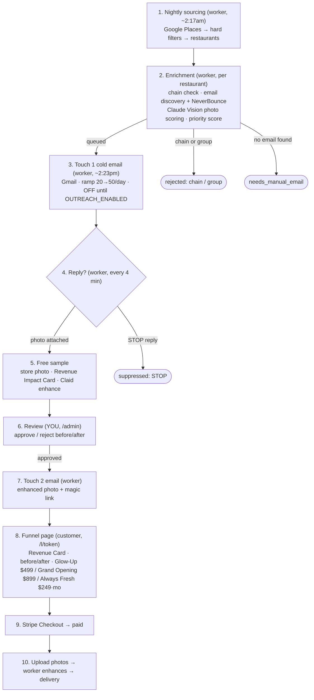
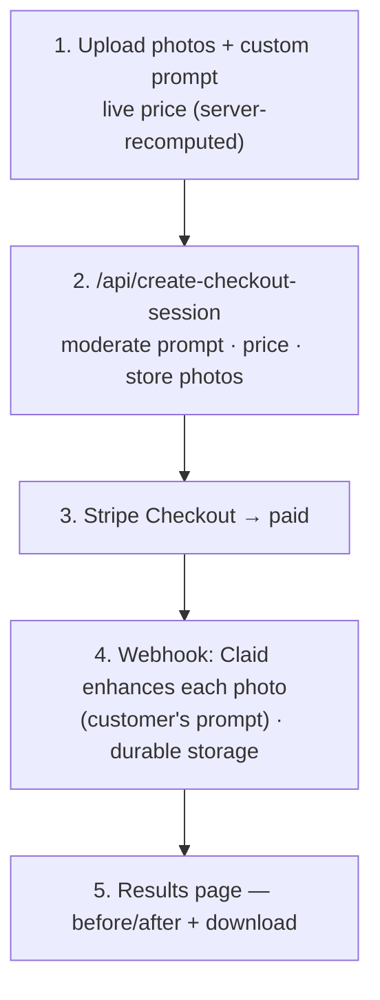

# Clickworthy — Pipeline & Workflow

How the system works end to end. Two pipelines run on **two Railway services**
(the `web` Next.js app and the `worker`), sharing one Postgres database.

- **web** — the Next.js app: marketing site, `/enhance`, `/l/[token]` funnel, `/admin`, all API routes, Stripe webhook.
- **worker** — the background service (`worker/`): pg-boss queues + crons for sourcing, enrichment, outreach, reply handling, and enhancement.

The core principle: **no photo is enhanced before a restaurant asks for it.** The
cold email *offers* enhancement; the restaurant replies with a photo; only then
does Claid run. Cost scales with *replies*, not with restaurants contacted.

---

## Pipeline A — Outreach funnel



### Step detail

1. **Nightly sourcing** — `worker/jobs/sourceLeads.ts`. Google Places Text Search for restaurants in Miami / New York / Chicago / Los Angeles → hard filters (rating ≤ 4.0, 30–500 reviews, `$`/`$$`, operational) → upsert to `restaurants` (`sourced`) → queue an enrichment job each. Google photos are **never stored** (ToS).
2. **Enrichment** — `worker/jobs/enrichRestaurant.ts`. Hospitality-group check (Claude + web search) → email discovery (scrape the site — Places has no emails) → **NeverBounce** verify → Claude Vision photo scoring (aggregates only) → priority score. Ends `queued`, `needs_manual_email`, or `rejected`.
3. **Touch 1** — `worker/jobs/sendOutreach.ts`. Deliverability guard → daily ramp cap → highest-priority `queued` restaurants → Claude writes the 3-line email → Gmail send from `mail@clickworthytool.com` → record thread, mark `contacted`. **Gated by `OUTREACH_ENABLED` (off by default).**
4. **Reply loop** — `worker/jobs/pollReplies.ts`. Match inbound replies to their thread. `STOP` → suppress. Photo attached → store it, create a magic link (`pending_review`), generate the Revenue Impact Card, queue the free enhancement.
5. **Free sample** — `worker/jobs/processFreeSample.ts`. Claid enhances the emailed photo (finalized prompt), stored durably. Stays `pending_review`.
6. **Review** — `app/admin`. You see before/after + Revenue Impact Card and **approve or reject**. Nothing reaches the prospect without this.
7. **Touch 2** — `worker/jobs/sendTouch2.ts`. Approved samples → email the enhanced photo + a link to `/l/[token]`.
8. **Funnel** — `app/l/[token]`. Revenue Impact Card → free before/after → "N more photos" teaser → high-ticket tiers (Menu Glow-Up $499, Grand Opening $899 one-time; Always Fresh $249/mo sold by call, bilingual en/es) → Stripe for the one-time tiers.
9. **Payment** — `app/api/outreach/checkout` (server-side price) → Stripe → the shared webhook marks the link paid.
10. **Delivery** — `app/l/[token]/upload` → customer uploads up to the package limit → `worker/jobs/processPackage.ts` (cron every 1 min) enhances via Claid → page auto-updates to a download grid.

---

## Pipeline B — Self-serve `/enhance` (standalone)



Anyone can use this directly, no outreach needed. Sliding price ($3.00/photo down
to a $1.80 floor), Claude moderates the free-text prompt, price is always
recalculated server-side, and the Stripe webhook runs the enhancement.

---

## Running underneath everything (Phase 4)

- **Retries** with backoff on every Claid enhance and Gmail send (`worker/lib/retry.ts`).
- **Operator alerts** via Resend when a paid order fails (`lib/alerts.ts`).
- **Deliverability auto-pause** — cold sending pauses itself if the 7-day opt-out/bounce rate exceeds 8%.
- **Weekly report** — pipeline stats emailed every Monday (`worker/jobs/weeklyStats.ts`).

---

## Where things live

| Concern | Path |
|---|---|
| Sourcing / enrichment / outreach jobs | `worker/jobs/`, `worker/lib/` |
| Queue + cron wiring | `worker/index.ts` |
| `/enhance` self-serve | `app/enhance/`, `app/api/create-checkout-session`, `app/api/webhooks/stripe` |
| Outreach funnel | `app/l/[token]/`, `app/api/outreach/` |
| Admin review | `app/admin/`, `proxy.ts` (Basic Auth) |
| Shared libs | `lib/` (claid, stripe, storage, packages, alerts, pricing) |
| DB schema | `db/schema.ts` |
| Worker deploy + env | `worker/README.md` |
```
