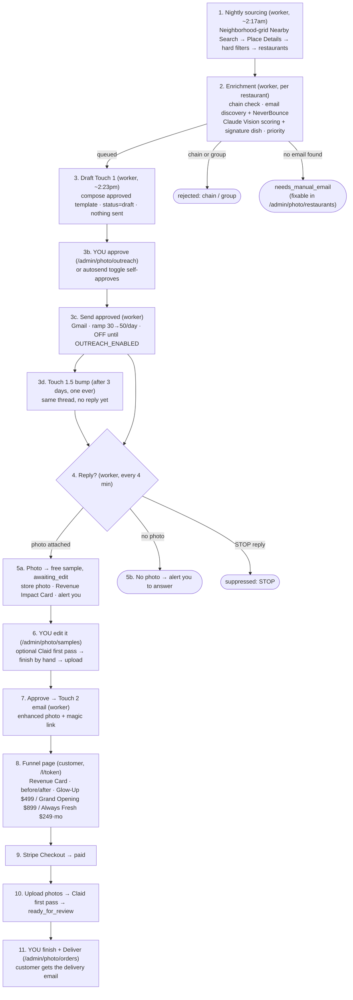
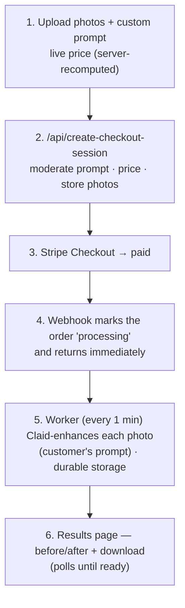

# Clickworthy — Pipeline & Workflow

How the system works end to end. Two pipelines run on **two Railway services**
(the `web` Next.js app and the `worker`), sharing one Postgres database.

- **web** — the Next.js app: landing page, `/enhance`, `/l/[token]` funnel, `/admin`, all API routes, Stripe webhook.
- **worker** — the background service (`worker/`): pg-boss queues + crons for sourcing, enrichment, outreach, reply handling, and enhancement.

Two core principles:

1. **No photo is enhanced before a restaurant asks for it.** The cold email
   *offers* enhancement; the restaurant replies with a photo; only then does any
   enhancement run. Cost scales with *replies*, not with restaurants contacted.
2. **A human finishes every photo a customer sees.** Claid is a first pass, never
   the final product, and never auto-sends. Enrique and Jose edit and approve.

---

## Pipeline A — Outreach funnel (high-ticket packages)



### Step detail

1. **Nightly sourcing** — `worker/jobs/sourceLeads.ts`. Sweeps a **neighborhood grid** (`worker/lib/grid.ts`) with Google Places **Nearby Search** (`rankPreference=DISTANCE`, `fine_dining_restaurant` excluded server-side) across Miami / New York / Chicago / Los Angeles. Citywide Text Search is prominence-ranked and only ever returned famous, well-photographed destinations (measured: median 9,554 reviews, zero under 500) — the grid returns every restaurant in each small circle nearest-first, so the modest neighborhood spots we actually serve enter the pool. The cheap Nearby sweep runs on the Pro SKU; **Place Details** (rating/reviews/price/website/phone) is fetched only for *new* places and only up to the nightly cap (`WORKER_NIGHTLY_ENRICH_CAP`, default 50 — the spend ceiling). Hard filters (`worker/lib/filters.ts`: 20–800 reviews, `$`/`$$`, has-website, operational) → upsert survivors to `restaurants` (`sourced`) and queue enrichment; filter-failures are recorded as `rejected` so they're never Details-fetched twice. Google photos are **never stored** (ToS).
2. **Enrichment** — `worker/jobs/enrichRestaurant.ts`. Hospitality-group check (Claude + web search, also grabs the owner's first name when findable) → email discovery (scrape the site — Places has no emails) → **NeverBounce** verify → Claude Vision photo scoring, which also names the **signature dish** → priority score. Ends `queued`, `needs_manual_email`, or `rejected`. A restaurant with no signature dish is held back — a generic Touch 1 is a deleted Touch 1.
3. **Touch 1 — draft, then send (two phases in one job)** — `worker/jobs/sendOutreach.ts`.
   - **Draft phase.** Highest-priority `queued` restaurants (with a signature dish, an email, not held/suppressed) → compose the **approved static template** (EN/ES, merges dish + first name, subject rotates across 3 approved lines) → write an outreach row with `status: 'draft'`. **Nothing is sent.** The batch waits for your approval in `/admin/photo/outreach`.
   - **Send phase.** Every draft you **approved** sends via Gmail from `mail@clickworthytool.com`, oldest approval first, up to the daily ramp cap → records thread ids, flips to `sent`, marks the restaurant `contacted`. Re-checks email/suppressed/held at send time (a draft may sit for days).
   - **Approval mode is the default** (`outreach_autosend` OFF). Flip the toggle in `/admin/photo/controls` and the draft phase writes rows already `approved`, so the same run sends them — full auto-send, no code change.
   - Gated by `OUTREACH_ENABLED` (drafting still runs when off, so you can review real drafts first) and the `outreach_paused` panic button.
   - **3b. Touch 1.5 bump** — `worker/jobs/sendBumps.ts`. 3 days, no reply → one same-thread bump, ever. The approved copy promises we won't follow up again, and the one-bump guard enforces that.
4. **Reply loop** — `worker/jobs/pollReplies.ts`. Match inbound replies to their thread; store the reply body + sender either way. `STOP` → suppress. **Photo attached** → store it, generate the Revenue Impact Card, create the magic link as **`awaiting_edit`**, and alert you. **Reply with no photo** (e.g. "how much?") → alert you to answer from your own Gmail inbox — it is never silently dropped.
5. **Free sample = manual production.** Nothing is auto-enhanced. The reply sits in `/admin/photo/samples` waiting for a human.
6. **You edit it** — `/admin/photo/samples`. Optionally run a one-click **Claid first pass** to start from, finish the photo by hand, upload the finished version.
7. **Approve → Touch 2** — approving sets the finished photo and flips the link to `approved`; `worker/jobs/sendTouch2.ts` then emails it with a link to `/l/[token]`. Sent **into the thread they replied in** (In-Reply-To points at their own message), so it reads as an answer rather than a new broadcast. If the thread can't be read, it still sends standalone — a photo someone is waiting for never gets blocked on a threading lookup.
8. **Funnel** — `app/l/[token]`. Revenue Impact Card → free before/after → "N more photos" teaser → the three tiers (Menu Glow-Up $499, Grand Opening $899 one-time; Always Fresh $249/mo sold on a call). Bilingual EN/ES.
9. **Payment** — `app/api/outreach/checkout` (price resolved server-side; `always_fresh` is rejected there, not just hidden in the UI) → Stripe → the shared webhook marks the link paid.
10. **Upload + first pass** — `app/l/[token]/upload` → customer uploads up to the package limit → `worker/jobs/processPackage.ts` (cron every 1 min) runs a Claid **first pass** on each photo and sets `ready_for_review`. The customer does **not** see these.
11. **You finish + deliver** — `/admin/photo/orders`. Per photo: re-run Claid or upload your edited version. "Deliver order" flips it to `completed`, unlocks the customer's download page, and sends the delivery email.

---

## Pipeline B — Self-serve `/enhance` (what the public landing sells)



This is what the **public landing page sells** — anyone can use it directly, no
outreach needed. Sliding price ($3.00/photo down to a $1.80 floor at 13+),
Claude moderates the free-text prompt, and price is always recalculated
server-side.

The webhook deliberately does **no** enhancement work: Claid takes ~1 min per
photo and Stripe re-delivers a webhook it hasn't heard back from in ~30s, so
enhancing inline would time out and the retry would re-run the whole batch at
double the Claid cost. The webhook only flips `pending → processing` (and only
from `pending`, so duplicate deliveries are harmless);
`worker/jobs/processEnhancementOrders.ts` does the work.

The high-ticket packages are deliberately **not** shown here or on the landing —
they exist only inside the outreach funnel.

---

## ClickWorthy Console — mission control

`/admin`, gated by a signed **session cookie** (`proxy.ts` covers `/admin/*` and
`/api/admin/*`, fail-closed if `SESSION_SECRET` unset). Passwords are scrypt-
hashed with a per-user salt; sessions are HMAC-signed, `HttpOnly`, 7-day expiry.
Create accounts:

```bash
bun run scripts/create-admin-user.ts you@clickworthytool.com "Your Name"
```

The console is a **multi-venture surface** — one dashboard, a dark sidebar that
switches between products. Photo Enhancement is the built venture; **HVAC AI
Appointment Setter · SMB Analytics · RE Broker Listing Videos** live as
styled placeholders ready to host their own pipelines. Each product picks its
own accent color; every card, subtab, and eyebrow recolors automatically.

`/admin` = the company **Business overview** (aggregate KPIs, product grid,
cross-venture needs-attention). Photo lives at **`/admin/photo/*`** with 8 subtabs:

| Tab | What it's for |
|---|---|
| Overview | Revenue in dollars, conversion funnel (sent → replied → sample → viewed → paid), per-city breakdown, 7-day stats, pipeline counts, live activity feed. |
| Outreach | **Drafts awaiting approval** at the top — approve / **edit body inline** / redraft / skip / approve-all — then the full log of every email sent, with reply bodies and "Open in Gmail ↗" links. |
| Samples | The free-sample edit queue, plus approved/rejected history. Un-reject to recover a mis-classified reply. |
| Orders | Package production queue, all package orders, self-serve orders. Click a self-serve row for the detail (customer's prompt, uploaded originals, results, **per-photo error strings**, Stripe deep link, Retry). Package rows have **Mark-paid** (off-Stripe entry) and **Resend delivery email**. |
| Leads | Browse + filter restaurants; search by name; **+ Add restaurant** (walk-in lead entry). Per-row detail page: all fields, inline edit for dish/name/language/email, hold/suppress/requeue, rejection reason, full timeline, **one-off manual email compose**. |
| Suppressions | Do-not-contact list. STOP replies land automatically; manual add/remove with confirms. |
| Controls | **Pause all sending** (panic button), **approval ↔ autosend** toggle, editable **daily cap** + **bump-days** the worker reads at run time, **deliverability guard** status, worker health with queue depth + "worker down?" alarm, boot-config snapshot, Run-now buttons. |
| Setup | **Go-live env-key checklist** — every environment variable, SET/MISSING on both web and worker, and what each missing key would break. Values are never rendered. |

### Approval flow (the core of the outreach half)

Cold email is **draft-first**. The nightly job composes Touch-1 drafts and stops; you approve them in **Outreach** before anything sends. Two DB toggles on **Controls** govern it (`app_settings` table, read fresh each run):

- **`outreach_autosend`** (default OFF) — ON makes new drafts self-approve and send in the same run (full auto-send). Flipping it ON does *not* retro-approve drafts already waiting.
- **`outreach_paused`** (default OFF) — panic button; blocks Touch 1, bumps, and Touch 2. Reply reading + drafting keep running.

`Hold` on a restaurant pulls it out of drafting without suppressing it; `Skip` on a draft deletes it and holds the restaurant. `Redraft` recomposes a draft from the restaurant's current fields — use it after fixing a bad signature dish on the detail page.

---

## Running underneath everything

- **Retries** with backoff on every Claid enhance and Gmail send (`worker/lib/retry.ts`).
- **Operator alerts** via Resend on new replies, orders ready, and failures (`lib/alerts.ts`).
- **Deliverability auto-pause** — cold sending pauses itself if the 7-day opt-out/bounce rate exceeds 8%.
- **Weekly report** — pipeline stats emailed every Monday (`worker/jobs/weeklyStats.ts`).

---

## Where things live

| Concern | Path |
|---|---|
| Sourcing / enrichment / outreach jobs | `worker/jobs/`, `worker/lib/` |
| Queue + cron wiring | `worker/index.ts` |
| Landing page | `app/page.tsx`, `app/components/Header.tsx` |
| `/enhance` self-serve | `app/enhance/`, `app/api/create-checkout-session`, `app/api/webhooks/stripe` |
| Outreach funnel | `app/l/[token]/`, `app/api/outreach/` |
| Console shell + login | `app/admin/layout.tsx`, `app/admin/Sidebar.tsx`, `app/admin/login/`, `proxy.ts` (session-cookie gate) |
| Photo venture | `app/admin/photo/*`, `app/api/admin/*` |
| Venture placeholders | `app/admin/{hvac,analytics,realestate}/` |
| Auth + user mgmt | `lib/auth.ts`, `lib/currentUser.ts`, `scripts/create-admin-user.ts` |
| Env-key checklist | `lib/envKeys.ts` (used by `app/admin/photo/setup/`) |
| Photo aggregates (revenue/funnel/city) | `lib/photoStats.ts` |
| Outreach settings + control | `lib/settings.ts` (app_settings), `lib/queue.ts` (web-side pg-boss for Run-now), `lib/queues.ts` (shared queue names) |
| Shared libs | `lib/` (claid, stripe, storage, packages, pricing, alerts, customerEmail, moderation, download proxy) |
| DB schema | `db/schema.ts` |
| Worker deploy + env | `worker/README.md` |
